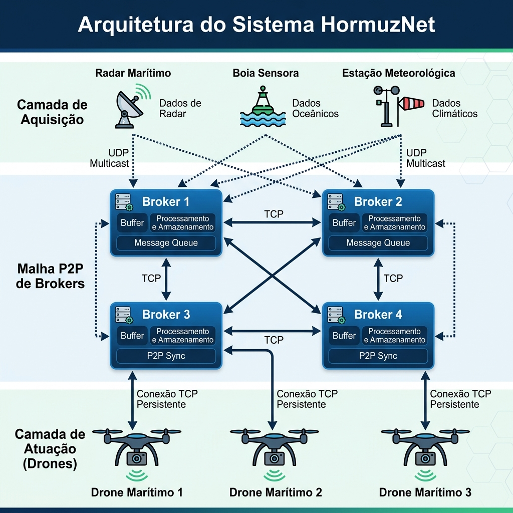

# HormuzNet: Monitoramento Marítimo Descentralizado e Autônomo

<p align="center">
  
</p>

O **HormuzNet** é uma plataforma de monitoramento marítimo e resposta tática em tempo real para a região estratégica do Estreito de Ormuz. Desenvolvido em **Go**, o projeto implementa uma arquitetura **totalmente distribuída e tolerante a falhas**, substituindo bases de controle centralizadas por uma malha cooperativa (*mesh*) de *brokers* P2P, sensores inteligentes e drones autônomos.

---

## 🚀 Diferenciais e Arquitetura

O sistema é dividido em três camadas lógicas que garantem consistência e alta disponibilidade:

### 1. Camada de Aquisição (UDP Multicast)
*   **Redundância Nativa:** Os sensores (Radares, Bóias, Sonar) não se conectam individualmente a servidores específicos. Eles publicam leituras em um endereço **Multicast UDP** (`224.1.2.3:9876`).
*   **Tolerância a Perdas:** Projetado para ambientes ruidosos. A perda de um pacote UDP não impacta o sistema, visto que sensores enviam leituras frequentes.

### 2. Camada de Sincronização (Descoberta P2P e Ring Failover)
*   **Descoberta Dinâmica:** Não há IPs hardcoded. O sistema utiliza um nó Líder (Centro/B9) para Descoberta. Quando os brokers ligam, eles perguntam ao líder quem está online e montam uma malha TCP dinâmica automaticamente.
*   **Filtro Regional e Ring Failover:** Cada Broker processa eventos de seu próprio setor geográfico. **Se um Broker morrer**, o algoritmo de **Herança em Anel (Ring Failover)** entra em ação. O próximo Broker sobrevivente na sequência assume os sensores da região morta, garantindo que não existam *pontos cegos* no mapa. 
*   **Relógio de Lamport:** A ordenação global de ocorrências é garantida através do algoritmo de Lamport, assegurando que todos mantenham filas de prioridade idênticas.

### 3. Camada de Atuação (Drones Autônomos)
*   **Exclusão Mútua Simplificada:** O Broker que possui conexão com o drone mais próximo efetua o despacho da ocorrência.
*   **Modelo de Falha Hostil:** Para simular as condições do Estreito, drones podem ser abatidos/perdidos (probabilidade configurada). O sistema recicla a ocorrência para a fila de prioridades e despacha um substituto.

---

## 🛠️ Como Rodar a Simulação (Menu Interativo)

Para facilitar a simulação de redes complexas em múltiplas máquinas, desenvolvemos um painel interativo. 

### Requisitos
*   [Docker](https://docs.docker.com/) e [Docker Compose](https://docs.docker.com/compose/).
*   (Opcional) Python 3 para o gerador de compose em background.

### Passos para Inicialização

1.  Abra o terminal e execute o menu:
    ```bash
    ./menu.sh
    ```
2.  **Passo a passo no Menu:**
    *   **Opção 1:** Inicia o Nó Líder (Broker 9) e exibe o IP físico do seu PC na rede.
    *   **Opção 2:** Cria os outros Brokers (seguidores). O script perguntará o IP do Líder.
    *   **Opções 3, 4 e 5:** Inicia o Monitor (Dashboard na porta 8082), Drones e Sensores, tudo dinamicamente apontado para a malha principal.

> **Modo Destruição (`kill_broker.sh`):** Para testar o *Ring Failover* em tempo real, rode o `./kill_broker.sh`. Ele listará todos os brokers rodando no seu Docker. Digite o nome de um deles e assista a rede perceber a queda e os vizinhos assumirem a carga instantaneamente!

---

## 📊 Painel de Monitoramento (WebSocket)
A interface tática atua como o consolidador visual do Estreito. Utilizando conexões **WebSocket**, o dashboard renderiza dinamicamente:
*   Posição, saúde e despacho de Drones.
*   Comunicação ativa P2P.
*   Alertas de Sensores e estado dos Brokers.

*(Acesse via: `http://localhost:8082` após subir a Opção 3 no menu)*

---

## 📄 Artigo e Documento Técnico
Uma documentação técnica detalhada contendo a fundamentação matemática, relógio de Lamport e testes de resiliência está disponível no formato LaTeX dentro de:
👉 `docs/solucao-hormuznet/principal.tex`
