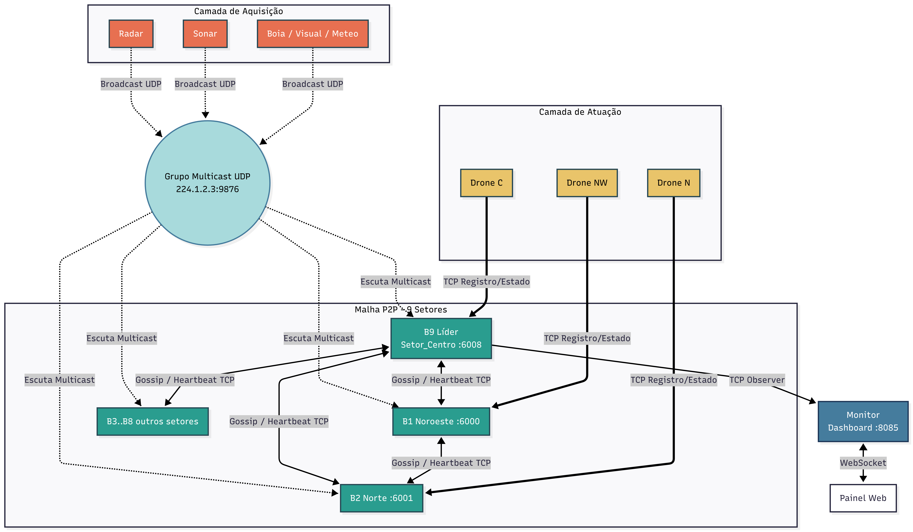

# HormuzNet — TEC502 - Problema 2 (Estreito de Ormuz)

Sistema de monitoramento marítimo distribuído, tolerante a falhas e autônomo para o Estreito de Ormuz, desenvolvido em Go sem o uso de middlewares ou frameworks de mensageria comerciais (como RabbitMQ ou Kafka), utilizando apenas a comunicação nativa da arquitetura de redes da Internet (UDP Multicast / TCP / WebSockets).

## 1. Cenário e Objetivo do Projeto

O Estreito de Ormuz é uma das vias marítimas mais estratégicas e críticas do mundo, por onde transita cerca de um quinto do consumo mundial de petróleo. Monitorar esta área contra incidentes, ameaças e falhas operacionais é de extrema importância. 

Em uma arquitetura centralizada clássica, a queda do servidor central interromperia instantaneamente todo o monitoramento e o envio de respostas táticas. Para evitar esse ponto único de falha, o **HormuzNet** estabelece uma **malha cooperativa descentralizada de brokers P2P**, sensores inteligentes e drones (VANTs) autônomos.

Nesta solução distribuída:
- **Sensores de Campo** publicam leituras via **UDP Multicast** para todos os brokers de forma simultânea.
- **Brokers de Setor** formam uma malha TCP P2P dinâmica que se auto-organiza via **Descoberta Dinâmica**, **Consenso Lógico de Lamport**, **Protocolo Gossip**, **Eleição Bully** e **Ring Failover**.
- **Drones Autônomos** acoplam-se via TCP ao broker ativo responsável pelo seu setor físico e realizam missões sob demanda, possuindo tolerância a quedas e reconexão com fallback automático.
- **Monitores** consolidam e de-duplicam o estado global, servindo uma interface gráfica em tempo real via **WebSockets (RFC 6455)** implementados nativamente.

---

## 2. Arquitetura do Sistema

### 2.1 Diagrama da Arquitetura

O sistema é dividido de forma a desacoplar a geração de eventos da lógica de despacho e do monitoramento tático:



### 2.2 Divisão Geográfica e de Portas TCP

O Estreito de Ormuz é mapeado em 9 setores dispostos em uma grade virtual. Cada setor possui um broker responsável e uma porta TCP de escuta padrão:

| Broker | Setor Relacionado | Porta TCP | Posição Base do Setor |
| :--- | :--- | :--- | :--- |
| **B1** | Noroeste | 6000 | (250, 250) |
| **B2** | Norte | 6001 | (500, 250) |
| **B3** | Nordeste | 6002 | (750, 250) |
| **B4** | Leste | 6003 | (750, 500) |
| **B5** | Sudeste | 6004 | (750, 750) |
| **B6** | Sul | 6005 | (500, 750) |
| **B7** | Sudoeste | 6006 | (250, 750) |
| **B8** | Oeste | 6007 | (250, 500) |
| **B9** | Centro *(Líder Inicial)* | 6008 | (500, 500) |

---

## 3. Componentes do Sistema

O HormuzNet é constituído por 4 componentes independentes desenvolvidos em **Go 1.23**:

### 3.1 Sensor (`code/cmd/sensor`)
Simula um dispositivo físico de monitoramento marítimo.
- **Tipos de Sensores:** `radar` (embarcações), `sonar` (submarinos), `boia` (altura de ondas), `visual` (câmeras de reconhecimento óptico) e `meteo` (estações meteorológicas).
- **Publicação:** Envia pacotes em JSON serializado via **UDP Multicast** no endereço de grupo `224.1.2.3:9876`.
- **Frequência e Posição:** Envia dados em intervalos customizáveis (ex: 20s) a partir de uma coordenada cartesiana $(X, Y)$ fixa.
- **Regra de Eventos:** Em 55% do tempo, gera dados ambientais normais (sem criticidade). Nos outros 45%, gera alertas táticos (`CriticidadeBaixa` ou `CriticidadeAlta`). Adicionalmente, possui uma taxa de injeção forçada de 7% de falhas/criticidades críticas para estressar as rotinas de despacho.

### 3.2 Broker de Setor (`code/cmd/broker`)
O núcleo lógico do sistema. Gerencia as ocorrências do setor físico sob sua jurisdição.
- **Escuta Multicast:** Lê todas as mensagens transmitidas no grupo UDP Multicast. No entanto, processa apenas os eventos correspondentes ao seu setor de responsabilidade (Filtro Geográfico) ou de setores vizinhos sob failover.
- **Fila de Prioridades:** Ordena internamente as ocorrências de forma consistente usando o **Relógio Lógico de Lamport**.
- **Ring Failover:** Monitora a saúde dos brokers vizinhos. Caso algum caia, o próximo broker sobrevivente na ordem circular (Anel) assume temporariamente as leituras daquele setor.
- **Eleição Ativa (Bully):** Se o Broker Líder ficar inoperante, inicia um processo de eleição dinâmico para coordenar a rede e as atualizações do Monitor.
- **Despacho de Recursos:** Identifica drones disponíveis e envia ordens de voo via socket TCP para o drone mais próximo da ocorrência de forma pró-ativa.

### 3.3 Drone (`code/cmd/drone`)
Veículo Aéreo Não Tripulado (VANT) encarregado de verificar as ocorrências no local.
- **Conectividade:** Conecta-se via socket TCP a uma lista de brokers de setor com mecanismo de **fallback dinâmico** e recarga automática (backoff exponencial de até 30s).
- **Relatório de Estado:** Envia keepalives periódicos (a cada 3s) ao broker informando sua posição física e estado operacional (`DISPONIVEL`, `DESPACHADO`, `EM_MISSAO`, `RETORNANDO`, `ABATIDO`).
- **Navegação Física:** Desloca-se até as coordenadas cartesianas do sensor da ocorrência, executa a operação (simulando um tempo de ação de 4 a 8 segundos) e retorna ao seu setor de patrulha original.
- **Simulação de Abate:** Possui uma chance aleatória de 10% de ser abatido ou avariado em trânsito. O processo do drone é finalizado e o broker re-enfileira a ocorrência imediatamente.

### 3.4 Monitor (`code/cmd/monitor`)
A central de exibição tática e consolidação de logs.
- **Descoberta Automática (Auto-discovery):** Conecta-se a um broker (preferencialmente o líder) e, através da mensagem `PEER_LIST`, descobre e se conecta via TCP a todos os outros brokers da malha.
- **De-duplicação:** Brokers redundantes podem retransmitir mensagens semelhantes. O monitor unifica o fluxo, evitando poluição visual.
- **WebSocket RFC 6455:** Contém um servidor de WebSocket implementado do zero para enviar snapshots JSON consolidados de 1 em 1 segundo para a interface web.
- **Painel Tático:** Página HTML interativa rodando na porta `8085` com mapa de posicionamento, log de eventos globais, status detalhado de brokers/drones e fila de ocorrências ativas.

---

## 4. Lógicas Distribuídas e Tolerância a Falhas

### 4.1 Consenso e Relógio Lógico de Lamport
Para garantir que todos os brokers ordenem as ocorrências na mesma ordem global, o sistema utiliza o **Relógio de Lamport**:
1. Cada broker possui um contador lógico local initialized em `0`.
2. Ao registrar uma ocorrência local, o broker incrementa o relógio: $L_{local} = L_{local} + 1$.
3. Ao enviar uma mensagem P2P, o tempo de Lamport é incluído no payload JSON.
4. Ao receber uma mensagem, o broker sincroniza seu relógio: $L_{local} = \max(L_{local}, L_{recebido}) + 1$.
5. A Fila de Prioridade ordena ocorrências por: `Criticidade (Alta > Baixa) -> LamportTime (Menor primeiro) -> Timestamp real (FIFO)`.

### 4.2 Gossip Protocol (P2P Mesh)
Os brokers não dependem de uma topologia centralizada. A malha é estabelecida via conexões P2P TCP diretas.
- Quando uma nova ocorrência é detectada, o broker responsável enfileira a tarefa localmente e faz um broadcast (`REQUISICAO_DRONE`) para todos os seus peers vizinhos ativos.
- O mesmo gossip ocorre quando um drone muda de estado (`SINC_DRONE`), é despachado (`DRONE_DESPACHADO`), conclui uma missão (`MISSAO_CONCLUIDA`) ou é abatido (`DRONE_PERDIDO`).

### 4.3 Descoberta Dinâmica de Nós (Discovery)
Quando um broker seguidor (ex: `B1`) inicia, ele não precisa saber os IPs de todos os outros nós:
1. O seguidor se conecta ao Broker Líder conhecido (`B9` na porta `6008`) e envia uma mensagem `DISCOVERY` informando sua porta TCP local.
2. O Líder insere esse novo broker na lista de peers conhecidos e responde com um pacote `PEER_LIST` contendo o IP:PORTA de todos os brokers já registrados na malha.
3. O Líder também envia um broadcast `PEER_LIST` com o novo nó para todos os outros brokers existentes.
4. Ao receber a lista de peers, os brokers avaliam se devem conectar-se ativamente ao novo nó (para evitar conexões TCP duplicadas entre os mesmos dois nós, a conexão é iniciada apenas pelo broker com menor porta TCP local).

### 4.4 Algoritmo de Eleição Bully
A malha do HormuzNet elege dinamicamente um coordenador para gerenciar a descoberta de peers e atuar como âncora do Monitor. O algoritmo **Bully** foi integrado para contornar falhas no Broker Líder:
1. **Detecção de Falha:** Cada broker envia batimentos cardíacos (`HEARTBEAT`) a cada 2.5s. Se um broker seguidor não receber keepalive do Líder atual por mais de 15 segundos, ele presume a falha do coordenador e inicia o processo de eleição.
2. **Fase de Eleição (`MsgEleicao`):** O broker que detectou a falha envia mensagens de eleição para todos os brokers ativos cujo ID numérico seja maior que o seu (ex: B3 envia para B4, B5, B6, B7, B8, B9).
3. **Respostas (`MsgEleicaoOk`):**
   - Se algum broker com ID maior estiver ativo, ele responde com `ELEICAO_OK` ao remetente menor e assume o início de sua própria eleição.
   - O broker menor, ao receber um `ELEICAO_OK`, silencia-se e aguarda o anúncio do coordenador.
4. **Coordenação (`MsgCoordenador`):** Se um broker não obtiver respostas com `ELEICAO_OK` dos IDs superiores dentro de um timeout (2s), ele se declara o novo líder e envia uma mensagem de `COORDENADOR` para todos os brokers sobreviventes da malha. O Monitor redireciona seu ponto de descoberta automaticamente.

### 4.5 Ring Failover (Herança Circular)
Se um broker responsável por um setor cai (ex: `B2` do Setor Norte), suas mensagens Multicast de sensores não seriam processadas por ninguém, deixando o setor desprotegido. O HormuzNet implementa o **Ring Failover**:
- Todos os brokers ativos conhecem a lista de membros da malha.
- Eles ordenam os IDs dos brokers alfabeticamente/numericamente em formato circular (ex: `B1 -> B2 -> B3 -> ... -> B9 -> B1`).
- Se `B2` cai (verificado pela expiração de 15s de heartbeats), cada broker executa o mesmo algoritmo de herança localmente:
  - O algoritmo avança recursivamente no anel a partir do nó morto até encontrar o primeiro broker que esteja ativo.
  - No caso de `B2` morto, o vizinho ativo anterior (`B1`) assume a responsabilidade sobre o setor do nó caído.
  - `B1` passa a aceitar e processar as mensagens UDP Multicast vindas do `Setor_Norte`.
- Quando `B2` retorna e envia uma mensagem TCP na malha, o broker herdeiro detecta seu reestabelecimento, encerra o failover regional e devolve o controle do setor para o dono original (`B2`), emitindo uma notificação `FAILOVER_RECUPERADO` para a rede.

### 4.6 Despacho Pró-ativo (Evitando Deadlocks)
Para evitar situações de impasse distribuído onde múltiplos brokers tentam travar o mesmo drone simultaneamente, o HormuzNet adota a abordagem de **Despacho Pró-ativo**:
- Cada broker gerencia localmente seus drones físicos conectados a ele (drones locais).
- O loop de despacho roda de forma concorrente a cada 500ms.
- Se o topo da Fila de Prioridades for uma ocorrência pendente e o broker possuir algum drone local livre, ele efetua o despacho imediatamente sem a necessidade de votação distribuída ou locks na rede.
- O broker marca o drone como ocupado localmente, remove a tarefa da fila e emite um broadcast de `DRONE_DESPACHADO` para que todos os outros brokers sincronizem o estado do drone e removam a ocorrência de suas filas locais correspondentes.

### 4.7 Envelhecimento de Ocorrências (Aging)
Para mitigar a inanição (starvation) de ocorrências de baixa prioridade (ex: uma boia de onda de criticidade BAIXA presa atrás de múltiplos alertas de RADAR críticos), a Fila de Prioridades possui um mecanismo de envelhecimento:
- Uma rotina roda a cada 10s no broker.
- Se uma ocorrência permanece na fila por mais de **30 segundos** sem atendimento, sua prioridade interna de ordenação no heap aumenta em **1 nível**.
- A prioridade pode subir até atingir a criticidade máxima (`CriticidadeAlta`), garantindo que ocorrências mais antigas subam de forma gradual e sejam atendidas pelos drones disponíveis.

---

## 5. Protocolo de Comunicação (Mensagens e APIs)

### 5.1 Sensor → Broker (UDP Multicast)
Enviado no grupo `224.1.2.3:9876` em JSON puro.

```json
{
  "sensor_id": "radar_noroeste_2",
  "setor_id": "Setor_Noroeste",
  "tipo": "radar",
  "posicao": {
    "x": 617,
    "y": 441
  },
  "valor": 82.5,
  "unidade": "objetos",
  "criticidade": 2,
  "timestamp": "2026-05-21T23:00:00Z"
}
```

*Nota: As criticidades são mapeadas como inteiros: `0` (Normal), `1` (Baixa), `2` (Alta).*

### 5.2 Broker ↔ Broker (TCP Gossip)
Mensagens transmitidas em conexões de socket TCP persistentes. Cada mensagem termina com o caractere delimitador `\n`.

```json
{
  "tipo": "REQUISICAO_DRONE",
  "broker_id": "B1",
  "setor_id": "Setor_Noroeste",
  "timestamp": "2026-05-21T23:00:01Z",
  "lamport_time": 14,
  "ocorrencia": {
    "id": "radar_noroeste_2-1779490800000000000",
    "setor_origem": "Setor_Noroeste",
    "broker_origem": "B1",
    "tipo": "radar",
    "descricao": "Sensor radar_noroeste_2: 82.50 objetos",
    "criticidade": 2,
    "posicao": {"x": 617, "y": 441},
    "timestamp": "2026-05-21T23:00:00Z",
    "lamport_time": 14
  }
}
```

#### Tipos de Mensagens de Malha (Broker ↔ Broker):
- `REGISTRO`: Handshake e identificação inicial ao conectar.
- `DISCOVERY`: Enviado por novos seguidores para solicitar peers ao Líder.
- `PEER_LIST`: Lista enviada pelo Líder contendo os endereços IP:PORTA conhecidos.
- `HEARTBEAT`: Batimento cardíaco periódico enviado a cada 2.5s para monitoramento de saúde.
- `REQUISICAO_DRONE`: Dispara uma nova ocorrência na malha distribuída.
- `DRONE_DESPACHADO`: Avisa que um drone foi acoplado e decolou para atender um incidente.
- `SINC_DRONE`: Sincroniza informações de posição, estado e ociosidade de um drone.
- `DRONE_PERDIDO`: Notifica a malha que um drone foi destruído (queda TCP ou simulação de abate).
- `MISSAO_CONCLUIDA`: Informa o sucesso do resgate e a liberação do drone.
- `REPLICA_FILA`: Envia um instantâneo das ocorrências sob custódia para brokers que se conectaram recentemente.
- `FAILOVER`: Notifica que um broker assumiu um setor órfão.
- `FAILOVER_RECUPERADO`: Notifica a devolução de posse do setor para o broker original restaurado.
- `ELEICAO`: Inicia o pleito do algoritmo Bully de eleição de coordenador.
- `ELEICAO_OK`: Mensagem de resposta indicando que um nó de maior ID assumiu a disputa.
- `COORDENADOR`: Declaratório de novo coordenador/líder eleito na malha.

### 5.3 Broker ↔ Drone (TCP)
#### Handshake inicial do Drone (`REGISTRO_DRONE`):
```json
{
  "tipo": "REGISTRO_DRONE",
  "drone_id": "Drone_NW_1",
  "timestamp": "2026-05-21T23:00:02Z",
  "drone_info": {
    "drone_id": "Drone_NW_1",
    "broker_id": "B1",
    "estado": "DISPONIVEL",
    "posicao": {"x": 250, "y": 250},
    "ultima_vez": "2026-05-21T23:00:02Z"
  }
}
```

#### Keepalive periódico do Drone (`KEEPALIVE_DRONE`):
```json
{
  "tipo": "KEEPALIVE_DRONE",
  "drone_id": "Drone_NW_1",
  "timestamp": "2026-05-21T23:00:05Z",
  "drone_info": {
    "drone_id": "Drone_NW_1",
    "broker_id": "B1",
    "estado": "DISPONIVEL",
    "posicao": {"x": 250, "y": 250},
    "ultima_vez": "2026-05-21T23:00:05Z"
  }
}
```

#### Comando de despacho enviado pelo Broker (`DESPACHAR_DRONE`):
```json
{
  "tipo": "DESPACHAR_DRONE",
  "ocorrencia_id": "radar_noroeste_2-1779490800000000000",
  "setor_destino": "Setor_Noroeste",
  "posicao_alvo": {"x": 617, "y": 441},
  "timestamp": "2026-05-21T23:00:06Z"
}
```

#### Resposta de mudança de estado do Drone (`DRONE_ESTADO`):
```json
{
  "tipo": "DRONE_ESTADO",
  "drone_id": "Drone_NW_1",
  "novo_estado": "EM_MISSAO",
  "ocorrencia_id": "radar_noroeste_2-1779490800000000000",
  "posicao": {"x": 617, "y": 441},
  "timestamp": "2026-05-21T23:00:08Z"
}
```

---

## 6. Estrutura de Diretórios do Repositório

```text
HormuzNet/
├── code/                           # Código fonte da aplicação em Go
│   ├── cmd/
│   │   ├── broker/
│   │   │   └── broker_main.go      # Regras do Broker (Failover, Gossip, Despacho, Bully)
│   │   ├── drone/
│   │   │   └── drone_main.go       # Simulador do Drone autônomo com fallback TCP
│   │   ├── monitor/
│   │   │   └── monitor_main.go     # Hub WebSocket e servidor de dashboard tático
│   │   └── sensor/
│   │       └── sensor_main.go      # Emulador de sensor físico UDP Multicast
│   ├── internal/
│   │   ├── fila/
│   │   │   └── fila.go             # Fila de prioridade heap com envelhecimento (Aging)
│   │   └── models/
│   │       └── dados.go            # Tipos de dados, enums e structs JSON compartilhadas
│   ├── Dockerfile.broker           # Build do contêiner Docker do Broker
│   ├── Dockerfile.drone            # Build do contêiner Docker do Drone
│   ├── Dockerfile.monitor          # Build do contêiner Docker do Monitor
│   ├── Dockerfile.sensor           # Build do contêiner Docker do Sensor
│   ├── generate_dynamic.py         # Script Python gerador de docker-compose para multi-host
│   └── go.mod                      # Módulo Go do HormuzNet
├── images/
│   └── arquitetura.png             # Diagrama arquitetural incorporado no README
├── docs/                           # Relatórios técnicos e especificação do problema
│   ├── TEC502 - Problema2 - Desbloqueio do Estreito de Ormuz.pdf
│   └── Barema P2 Estreito de Ormuz.pdf
├── docker-compose-all.yml          # Compose monolítico com 34 contêineres unificados
├── generate_all.py                 # Script Python gerador do docker-compose-all.yml
├── menu.sh                         # CLI interativa para controle distribuído (multi-host)
├── eliminar.sh                     # Utilitário Bash para remoção rápida de contêineres ativos
└── terminais.sh                    # Script Bash para abrir logs dos contêineres em abas/janelas
```

---

## 7. Pré-requisitos para Execução

- **Docker Engine 20+** e **Docker Compose** (suporta plugin v2 `docker compose` ou standalone `docker-compose`).
- **Python 3** com biblioteca `PyYAML` instalada (necessária para rodar os scripts de orquestração `.py`).
- **Go 1.23+** (apenas se optar por rodar os binários diretamente em modo bare-metal, fora de contêineres).
- Sistema Operacional **Linux** de preferência (o modo Multicast UDP e o parâmetro de rede `network_mode: host` dos contêineres necessitam de compatibilidade Linux nativa, podendo apresentar limitações no Docker para macOS/Windows).

---

## 8. Como Executar o Sistema

### 8.1 Execução Monolítica (Tudo em 1 só Máquina)
Ideal para testes locais rápidos, inicializando 9 brokers, 6 drones, 18 sensores e o monitor de controle centralizado em um só host.

```bash
# 1. Acesse o diretório do projeto
cd HormuzNet

# 2. Gere o arquivo compose completo de simulação
python3 generate_all.py

# 3. Compile e suba todos os contêineres em segundo plano
docker compose -f docker-compose-all.yml up -d --build
```
Acesse a página de visualização tática no navegador em: `http://localhost:8085`.

### 8.2 Execução Distribuída (Multi-PC/Máquinas Virtuais na mesma Rede Local)
O HormuzNet foi projetado para rodar de forma descentralizada em diferentes computadores interconectados no mesmo switch físico ou sub-rede L2.

#### Passo 1: Executar o Broker Líder na Máquina A
1. Abra o console do terminal no projeto e execute o menu interativo:
   ```bash
   ./menu.sh
   ```
2. Digite a opção `1` (**Subir Broker Líder (Centro/B9)**).
3. O terminal irá construir e disparar o contêiner B9 e exibirá o IP físico da máquina (ex: `192.168.100.15`). Anote este IP.

#### Passo 2: Executar Brokers Seguidores na Máquina B
1. Execute `./menu.sh` na Máquina B.
2. Escolha a opção `2` (**Subir Brokers Adicionais (Seguidores)**).
3. Informe o IP do Líder anotado anteriormente (`192.168.100.15`).
4. Digite a quantidade de brokers seguidores que deseja levantar nessa máquina (ex: `4`).
5. Informe o ID de início (se for o primeiro conjunto de seguidores, use `1` para rodar B1, B2, B3 e B4).

#### Passo 3: Executar Drones na Máquina C
1. Execute `./menu.sh` na Máquina C.
2. Escolha a opção `4` (**Subir Drones**).
3. Informe o IP do Líder (`192.168.100.15`) e a quantidade de drones a subir (ex: `6`).

#### Passo 4: Executar Sensores na Máquina D
1. Execute `./menu.sh` na Máquina D.
2. Escolha a opção `5` (**Subir Sensores**).
3. Insira o IP do Líder (`192.168.100.15`), a partir de qual setor cobrir e a quantidade de sensores.

#### Passo 5: Inicializar o Dashboard (Pode rodar em qualquer host)
1. Escolha a opção `3` (**Subir Monitor**) no menu de qualquer um dos computadores participantes.
2. Forneça o IP do Líder.
3. Abra a interface de controle no navegador de qualquer host da rede apontando para: `http://192.168.100.15:8085`.

---

## 9. Ferramentas auxiliares de Simulação e Testes

O HormuzNet disponibiliza scripts úteis para testar a resiliência dos algoritmos distribuídos:

### 9.1 Testando o Ring Failover e Eleição
Para forçar incidentes de rede e validar a tolerância a falhas distribuídas, utilize o script `eliminar.sh`:

```bash
./eliminar.sh
```

O script listará todos os contêineres ativos da simulação na máquina atual:
```text
=== Contêineres Ativos do HormuzNet ===
  1) hormuznet_broker9 (Up 4 minutes)
  2) hormuznet_broker2 (Up 4 minutes)
  3) hormuznet_drone_n_2 (Up 2 minutes)

Digite os números (ex: 1 3) ou 'tudo' para parar:
```
- **Caso 1 (Ring Failover):** Pare um broker de setor (ex: `B2`). No dashboard, observe que o setor correspondente (`Setor_Norte`) ficará vermelho (Broker inativo), mas as ocorrências geradas ali continuarão a ser atendidas pelo broker herdeiro determinado no anel. Ao reiniciar o broker, ele recupera a custódia do setor automaticamente.
- **Caso 2 (Eleição Bully):** Pare o Broker Líder (`B9`). Os outros brokers remanescentes identificarão a parada e iniciarão o algoritmo Bully. Em poucos segundos, um novo líder será acordado e assumirá o papel, mantendo o Monitor operacional.

### 9.2 logs em Tempo Real (`terminais.sh`)
Para depurar a troca de mensagens em nível de protocolo de soquetes, o utilitário `terminais.sh` abre dinamicamente abas individuais com o comando `docker logs -f` para cada contêiner ativo:

```bash
./terminais.sh
```
*(Compatível com emuladores de terminal Gnome Terminal, XTerm, Konsole e XFCE Terminal).*

---

## 10. Concorrência e Práticas de Confiabilidade no Código Go

O HormuzNet implementa conceitos estritos de programação concorrente em Go para evitar race conditions e starvation:
- **Exclusão Mútua Separada:** O broker não utiliza um lock global. Estruturas como mapas de `drones`, `ocorrencias` locais, `fila` de prioridades, `vizinhos` e logs de `atendidos` possuem seus próprios primitivos `sync.RWMutex`, reduzindo o gargalo de concorrência.
- **Prevenção de Fuga de Memória em Conexões:** Operações de escrita em soquetes TCP possuem prazos limite configurados com `SetWriteDeadline(time.Now().Add(2 * time.Second))`, impedindo goroutines de ficarem bloqueadas para sempre em conexões travadas na rede.
- **Robustez nas Leituras:** O processamento de dados TCP utiliza `bufio.Scanner` com regras de delimitação de frames por `\n`, tratando de forma automática a fragmentação de pacotes de fluxo contínuo.
- **Redundância e Filtro Tático no Monitor:** O dashboard possui chaves booleanas (`alreadyDespatched`, `alreadyAbatido`, etc.) para de-duplicar eventos concorrentes recebidos de múltiplos brokers e manter o canvas tático limpo.
