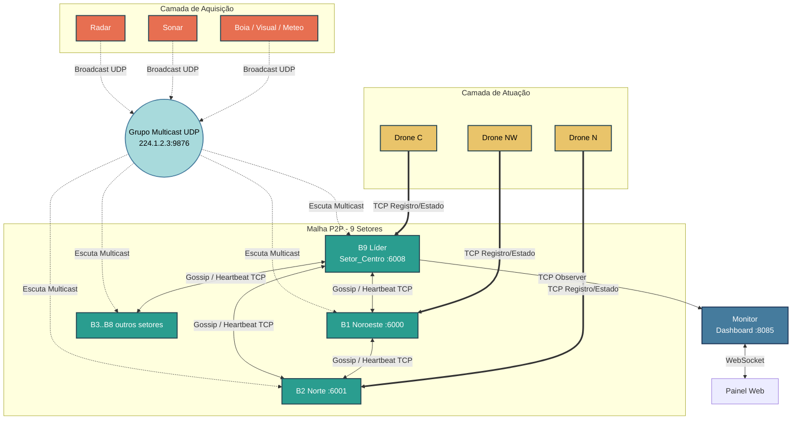

# HormuzNet — TEC502 - Problema 2 (Estreito de Ormuz)

Sistema de monitoramento marítimo distribuído e autônomo para o Estreito de Ormuz, desenvolvido sem framework de mensageria, usando apenas comunicação nativa da arquitetura da Internet (UDP Multicast / TCP / WebSocket).

## 1. Objetivo do Projeto

Este projeto resolve o problema de monitoramento e resposta tática em uma região marítima estratégica de alta criticidade — o Estreito de Ormuz — por meio de uma **malha cooperativa descentralizada de brokers P2P**, sensores inteligentes e drones autônomos.

No cenário original, uma arquitetura centralizada cria um ponto único de falha: se o servidor cair, toda a vigilância colapsa. Nesta solução:

- sensores publicam leituras via **UDP Multicast** para todos os brokers simultaneamente;
- brokers formam uma **malha TCP P2P** com descoberta dinâmica e sincronização via Gossip;
- drones conectam-se via TCP ao broker mais próximo e executam missões de forma autônoma;
- o monitor consolida o estado global e expõe um **dashboard Web em tempo real via WebSocket**.

## 2. Arquitetura e Componentes

### 2.1 Diagrama da Arquitetura



### 2.2 Componentes Principais

1. **Sensor (`cmd/sensor`)**
   - Simula dispositivos físicos: `radar`, `sonar`, `boia`, `visual`, `meteo`.
   - Gera leituras com valor, unidade e criticidade de acordo com o tipo.
   - Publica via **UDP Multicast** (`224.1.2.3:9876`) a cada intervalo configurável.
   - 30% das leituras geram ocorrências; 2% têm injeção forçada de criticidade ALTA.

2. **Broker de Setor (`cmd/broker`)**
   - Um por setor geográfico (9 setores: Noroeste, Norte, Nordeste, Leste, Sudeste, Sul, Sudoeste, Oeste, Centro).
   - Escuta UDP Multicast e filtra eventos do seu setor.
   - Mantém fila de prioridades ordenada por Relógio de Lamport.
   - Sincroniza estado de drones e ocorrências com vizinhos via Gossip TCP.
   - Dispara heartbeats periódicos e detecta falhas de vizinhos.
   - Executa **Ring Failover** quando um broker vizinho cai.
   - Despacha o drone disponível mais próximo de forma pró-ativa.

3. **Drone (`cmd/drone`)**
   - VANT autônomo que se conecta via TCP a um broker com fallback automático.
   - Reporta posição e estado por keepalive periódico a cada 3s.
   - Executa missões: deslocamento → operação → retorno.
   - Simula 10% de chance de abate durante a missão (força replanejamento).

4. **Monitor (`cmd/monitor`)**
   - Conecta-se ao Broker Líder e descobre automaticamente os demais via `PEER_LIST`.
   - De-duplica eventos recebidos de múltiplos brokers.
   - Detecta brokers inativos por timeout de heartbeat (15s).
   - Serve dashboard HTML/CSS/JS embutido com **WebSocket RFC 6455** (sem libs externas).
   - Atualiza o painel a cada 1 segundo via push de snapshot.

### 2.3 Fluxo Resumido

1. Sensor gera leitura e publica via UDP Multicast para `224.1.2.3:9876`.
2. Todos os brokers recebem o pacote; apenas o **responsável pelo setor** processa.
3. O broker cria uma Ocorrência, enfileira com timestamp de Lamport e faz broadcast Gossip para vizinhos.
4. O loop de despacho (`loopDespachar`) seleciona o drone local disponível mais próximo e envia `DESPACHAR_DRONE` via TCP.
5. O drone executa a missão e notifica o broker com atualizações de estado.
6. O Monitor recebe todos esses eventos e os exibe no dashboard em tempo real.

### 2.4 Mapa de Setores e Portas TCP

| Broker | Setor         | Porta TCP |
|--------|---------------|-----------|
| B1     | Noroeste      | 6000      |
| B2     | Norte         | 6001      |
| B3     | Nordeste      | 6002      |
| B4     | Leste         | 6003      |
| B5     | Sudeste       | 6004      |
| B6     | Sul           | 6005      |
| B7     | Sudoeste      | 6006      |
| B8     | Oeste         | 6007      |
| B9     | Centro (Líder)| 6008      |

## 3. Mecanismos Distribuídos

### 3.1 Relógio de Lamport

Cada broker mantém um contador lógico (`lamport`). A cada evento gerado localmente o contador é incrementado (`tick`). Ao receber uma mensagem de outro broker, o relógio é sincronizado com `max(local, recebido) + 1`. A fila de prioridades usa `LamportTime` para ordenação global consistente entre todos os nós.

### 3.2 Gossip P2P e Descoberta Dinâmica

Ao iniciar, um broker seguidor conecta-se ao **Broker Líder (B9)** enviando uma mensagem `DISCOVERY`. O líder responde com `PEER_LIST` contendo os endereços de todos os outros brokers conhecidos. O seguidor então estabelece conexões TCP diretas com cada peer, formando a malha completa sem IPs hardcoded.

### 3.3 Ring Failover

Quando um heartbeat de um vizinho expira, o broker marca-o como morto. O algoritmo de **herança em anel** ordena alfabeticamente todos os IDs de brokers e determina quem é o próximo sobrevivente na sequência circular após o broker morto. Esse broker assume o processamento dos eventos do setor vizinho sem intervenção manual.

### 3.4 Despacho Pró-ativo (Sem Impasse)

O loop de despacho (`loopDespachar`, intervalo 500ms) verifica o topo da fila. Se o broker possui um drone local disponível, ele despacha imediatamente sem consultar outros brokers. Isso evita o impasse onde múltiplos brokers aguardam confirmação uns dos outros.

## 4. Protocolo (Mensagens e API)

### 4.1 Sensor → Broker (UDP Multicast `224.1.2.3:9876`)

Formato `LeituraSensor` (JSON):

```json
{
  "sensor_id": "radar_norte_1",
  "setor_id": "Setor_Norte",
  "tipo": "radar",
  "posicao": {"x": 263, "y": 791},
  "valor": 82.5,
  "unidade": "objetos",
  "criticidade": 2,
  "timestamp": "2026-05-20T22:00:00Z"
}
```

Criticidades: `0` = NORMAL, `1` = BAIXA, `2` = ALTA. Apenas leituras com criticidade ≥ BAIXA são enfileiradas.

### 4.2 Broker ↔ Broker (TCP — Gossip e Sincronização)

Formato `MensagemBroker` (JSON delimitado por `\n`):

```json
{
  "tipo": "REQUISICAO_DRONE",
  "broker_id": "B2",
  "setor_id": "Setor_Norte",
  "timestamp": "2026-05-20T22:00:01Z",
  "lamport_time": 42,
  "ocorrencia": { ... }
}
```

Tipos de mensagem broker↔broker:

| Tipo                  | Descrição                                              |
|-----------------------|--------------------------------------------------------|
| `REGISTRO`            | Handshake inicial entre brokers                        |
| `DISCOVERY`           | Seguidor solicita lista de peers ao Líder              |
| `PEER_LIST`           | Líder responde com endereços conhecidos                |
| `HEARTBEAT`           | Sinal de vida periódico (5s)                           |
| `REQUISICAO_DRONE`    | Broadcast de nova ocorrência para a malha              |
| `DRONE_DESPACHADO`    | Notifica que um drone foi alocado para a ocorrência    |
| `SINC_DRONE`          | Atualiza o estado/posição de um drone na malha         |
| `DRONE_PERDIDO`       | Notifica abate ou desconexão de drone                  |
| `MISSAO_CONCLUIDA`    | Drone retornou e ocorrência está encerrada             |
| `FAILOVER`            | Broker assumiu setor de vizinho morto                  |
| `FAILOVER_RECUPERADO` | Vizinho voltou, setor devolvido                        |
| `REPLICA_FILA`        | Snapshot de ocorrências pendentes para sincronização   |

### 4.3 Broker → Drone (TCP)

Handshake: drone envia `REGISTRO_DRONE` ao conectar com `InfoDrone` completo.
Keepalive: drone envia `KEEPALIVE_DRONE` a cada 3s com posição atual.

Comando de despacho `ComandoDrone`:

```json
{
  "tipo": "DESPACHAR_DRONE",
  "ocorrencia_id": "radar_norte_1-1716242401000000000",
  "setor_destino": "Setor_Norte",
  "posicao_alvo": {"x": 263, "y": 791},
  "timestamp": "2026-05-20T22:00:02Z"
}
```

Resposta do drone `MensagemDrone`:

```json
{
  "tipo": "DRONE_ESTADO",
  "drone_id": "Drone_NW_1",
  "novo_estado": "EM_MISSAO",
  "ocorrencia_id": "radar_norte_1-...",
  "posicao": {"x": 263, "y": 791},
  "timestamp": "2026-05-20T22:00:05Z"
}
```

Estados do drone: `DISPONIVEL` → `DESPACHADO` → `EM_MISSAO` → `RETORNANDO` → `DISPONIVEL` (ou `ABATIDO`).

### 4.4 Monitor ↔ Dashboard (WebSocket `/ws`)

O monitor implementa WebSocket RFC 6455 do zero (sem bibliotecas externas). Publica um snapshot completo a cada 1s:

```json
{
  "drones": { "Drone_NW_1": { "drone_id": "...", "estado": "DISPONIVEL", ... } },
  "brokers": [ { "id": "B9", "addr": "127.0.0.1:6008", "vivo": true, ... } ],
  "eventos": [ { "timestamp": "...", "tipo": "DESPACHO", "mensagem": "...", "nivel": "warn" } ],
  "ocorrencias": { "id-...": { "tipo": "radar", "criticidade": "ALTA", "status": "ANDAMENTO" } },
  "failovers": { "Setor_Norte": "B2" }
}
```

### 4.5 Endpoints HTTP do Monitor

| Método | Rota         | Descrição                          |
|--------|--------------|------------------------------------|
| `GET`  | `/`          | Dashboard HTML completo embutido   |
| `GET`  | `/ws`        | WebSocket para atualizações ao vivo|
| `GET`  | `/api/estado`| Snapshot JSON do estado atual      |

### 4.6 Regras de Framing TCP

Todas as mensagens TCP (broker↔broker, broker↔drone) usam **JSON delimitado por nova linha** (`\n`). Cada peer lê com `bufio.Scanner`, que isola linhas automaticamente.

## 5. Tipos de Sensores e Lógica de Criticidade

| Tipo     | Unidade    | Limiar ALTA         | Exemplo de uso              |
|----------|------------|---------------------|-----------------------------|
| `radar`  | objetos    | valor > 75          | Detecção de embarcações     |
| `sonar`  | dB         | valor > 100         | Detecção de submarinos      |
| `boia`   | m          | valor > 7           | Altura de ondas anômalas    |
| `visual` | confiança  | valor > 0.85        | Reconhecimento óptico       |
| `meteo`  | °C         | valor > 45 ou < -5  | Condições climáticas severas|

Adicionalmente, 2% das leituras têm injeção forçada de criticidade ALTA para estressar o sistema. 70% das leituras não geram ocorrência (apenas leituras de ambiente).

## 6. Estrutura de Diretórios

```text
HormuzNet/
├── code/
│   ├── cmd/
│   │   ├── broker/
│   │   │   └── broker_main.go      # Broker de setor (P2P, Gossip, Failover)
│   │   ├── drone/
│   │   │   └── drone_main.go       # VANT autônomo com fallback TCP
│   │   ├── monitor/
│   │   │   └── monitor_main.go     # Dashboard e consolidador WebSocket
│   │   └── sensor/
│   │       └── sensor_main.go      # Sensor UDP Multicast simulado
│   ├── internal/
│   │   ├── fila/                   # Fila de prioridades (Lamport)
│   │   └── models/
│   │       └── dados.go            # Structs e tipos compartilhados
│   ├── assets/                     # Recursos estáticos do dashboard
│   ├── generate_dynamic.py         # Gerador de docker-compose por modo/PC
│   ├── Dockerfile.broker
│   ├── Dockerfile.drone
│   ├── Dockerfile.monitor
│   ├── Dockerfile.sensor
│   └── go.mod
├── images/
│   └── arquitetura_hormuz.png
├── docs/
│   └── (PDFs e especificação do problema)
├── docker-compose-all.yml          # Compose completo (ambiente monolítico)
├── generate_all.py                 # Gera docker-compose-all.yml
├── menu.sh                         # Menu interativo multi-PC
├── eliminar.sh                     # Para/remove contêineres ativos
└── terminais.sh                    # Abre logs individuais em terminais
```

## 7. Pacotes e Tecnologias

- **Go 1.23** — linguagem principal de todos os serviços
- **Biblioteca padrão Go** — `net`, `encoding/json`, `sync`, `bufio`, `flag`, `log`
- **Python 3** — scripts geradores de docker-compose (`generate_dynamic.py`, `generate_all.py`)
- **Docker / Docker Compose** — containerização e orquestração
- **WebSocket RFC 6455** — implementado do zero no monitor (sem `gorilla/websocket`)
- **UDP Multicast** — grupo `224.1.2.3:9876` para publicação de sensores

## 8. Pré-requisitos

- Docker Engine 20+ (ou equivalente compatível)
- Docker Compose v1 (standalone `docker-compose`) **ou** v2 (plugin `docker compose`) — o `menu.sh` detecta automaticamente
- Python 3.6+ com pacote `pyyaml` (para os scripts geradores)
- Go 1.23+ (apenas para execução sem Docker)

## 9. Argumentos de Linha de Comando

### Broker

| Flag         | Padrão            | Descrição                                          |
|--------------|-------------------|----------------------------------------------------|
| `-id`        | *(obrigatório)*   | ID único do broker (ex: `B1`)                      |
| `-setor`     | *(obrigatório)*   | Nome do setor geográfico (ex: `Setor_Norte`)       |
| `-udp`       | `224.1.2.3:9876`  | Endereço do grupo Multicast UDP                    |
| `-tcp`       | `0.0.0.0:6000`    | Porta TCP para drones e brokers vizinhos           |
| `-lider`     | *(vazio)*         | IP:PORT do Líder para discovery; se vazio = líder  |
| `-vizinhos`  | *(vazio)*         | Lista de vizinhos fixos separados por vírgula      |

### Drone

| Flag       | Padrão              | Descrição                                          |
|------------|---------------------|----------------------------------------------------|
| `-id`      | *(obrigatório)*     | ID único do drone (ex: `Drone_NW_1`)               |
| `-brokers` | `localhost:6000`    | Endereços TCP dos brokers (vírgula, fallback)      |
| `-x`       | `0`                 | Posição X inicial no mapa                          |
| `-y`       | `0`                 | Posição Y inicial no mapa                          |

### Monitor

| Flag       | Padrão           | Descrição                                           |
|------------|------------------|-----------------------------------------------------|
| `-brokers` | `localhost:6000` | Endereço do Broker Líder (ponto inicial de descoberta)|
| `-porta`   | `8085`           | Porta HTTP do dashboard                             |

### Sensor

| Flag         | Padrão              | Descrição                                        |
|--------------|---------------------|--------------------------------------------------|
| `-id`        | `sensor_01`         | ID único do sensor                               |
| `-tipo`      | `radar`             | Tipo: `radar`, `sonar`, `boia`, `visual`, `meteo`|
| `-setor`     | `Setor_Norte`       | Setor ao qual o sensor pertence                  |
| `-broker`    | `224.1.2.3:9876`    | Endereço Multicast UDP de destino                |
| `-intervalo` | `1000`              | Intervalo entre leituras em milissegundos        |
| `-x` / `-y`  | `0`                 | Posição geográfica do sensor no mapa             |

## 10. Como Executar

### 10.1 Execução completa em 1 máquina (ambiente monolítico)

Sobe todos os 9 brokers + 7 drones + 18 sensores + monitor de uma vez:

```bash
# Gera o docker-compose-all.yml com sensores aleatórios
python3 generate_all.py

# Sobe tudo
docker compose -f docker-compose-all.yml up --build
```

Acesso: `http://localhost:8085`

### 10.2 Execução com menu interativo (recomendado para multi-PC)

```bash
./menu.sh
```

O menu detecta automaticamente se o ambiente usa `docker compose` (v2) ou `docker-compose` (v1) e exibe:

```
╔══════════════════════════════════════════════════════════╗
║              HormuzNet — Painel de Controle              ║
╚══════════════════════════════════════════════════════════╝

Escolha um componente para subir neste PC:
1) Subir Broker Líder (Centro/B9)
2) Subir Brokers Adicionais (Seguidores)
3) Subir Monitor
4) Subir Drones
5) Subir Sensores
0) Sair
```

**Passo a passo:**
- **Opção 1:** Inicia o Broker Líder (B9). O menu exibe o IP físico do PC — anote-o.
- **Opção 2:** Cria brokers seguidores. Informe o IP do Líder e quantos brokers subir (1–8).
- **Opção 3:** Sobe o Monitor apontando para o Líder. Dashboard disponível na porta 8085.
- **Opção 4:** Sobe N drones autônomos conectados ao Líder.
- **Opção 5:** Sobe sensores (2 por setor) em broadcast Multicast.

### 10.3 Execução em múltiplas máquinas (rede local)

**Máquina A — Broker Líder:**

```bash
./menu.sh   # Opção 1
# Anote o IP exibido, ex: 192.168.101.7
```

**Máquina B — Brokers Seguidores:**

```bash
./menu.sh   # Opção 2
# IP do Líder: 192.168.101.7
# Quantos brokers: 4
```

**Máquina C — Drones:**

```bash
./menu.sh   # Opção 4
# IP do Líder: 192.168.101.7
# Quantos drones: 7
```

**Máquina D — Sensores:**

```bash
./menu.sh   # Opção 5
# IP do Líder: 192.168.101.7
# Setores a cobrir: 9
```

**Monitoramento (qualquer máquina):**

```
http://192.168.101.7:8085
```

Portas que devem estar acessíveis na rede:

| Porta | Protocolo | Serviço                        |
|-------|-----------|--------------------------------|
| 6000–6008 | TCP   | Brokers (um por setor)         |
| 9876  | UDP Multicast | Sensores (grupo 224.1.2.3) |
| 8085  | TCP (HTTP/WS) | Dashboard do Monitor       |

### 10.4 Execução sem Docker (Go direto)

```bash
cd code

# Compilar
go build -o bin/broker ./cmd/broker
go build -o bin/drone  ./cmd/drone
go build -o bin/monitor ./cmd/monitor
go build -o bin/sensor  ./cmd/sensor

# Rodar o Líder
./bin/broker -id=B9 -setor=Setor_Centro -tcp=0.0.0.0:6008

# Rodar um seguidor
./bin/broker -id=B1 -setor=Setor_Noroeste -tcp=0.0.0.0:6000 -lider=127.0.0.1:6008

# Rodar o Monitor
./bin/monitor -brokers=127.0.0.1:6008 -porta=8085

# Rodar um Drone
./bin/drone -id=Drone_NW_1 -brokers=127.0.0.1:6008 -x=250 -y=250

# Rodar um Sensor
./bin/sensor -id=radar_norte_1 -tipo=radar -setor=Setor_Norte -intervalo=20000 -x=263 -y=791
```

## 11. Ferramentas de Operação

### `eliminar.sh` — Parar contêineres seletivamente

Lista todos os contêineres ativos do HormuzNet com status e permite pará-los individualmente ou em massa:

```bash
./eliminar.sh
```

```
=== Contêineres Ativos do HormuzNet ===
  1) hormuznet_broker9 (Up 5 minutes)
  2) hormuznet_broker1 (Up 5 minutes)
  3) hormuznet_drone_nw_1 (Up 3 minutes)

Digite os números (ex: 1 3) ou 'tudo' para limpar tudo:
```

> **Dica de teste de resiliência:** derrube um broker com `./eliminar.sh` e observe o Ring Failover assumir o setor no dashboard em tempo real.

### `terminais.sh` — Logs em janelas separadas

Abre um terminal dedicado com `docker logs -f` para cada contêiner ativo. Suporta automaticamente `gnome-terminal`, `xterm`, `konsole` e `xfce4-terminal`:

```bash
./terminais.sh
```

## 12. Dashboard Web (Monitor)

Acesse via `http://localhost:8085` após subir o Monitor (opção 3 do menu).

O dashboard exibe em tempo real:

- **Painel de Drones** — ID, estado (`DISPONIVEL` / `DESPACHADO` / `EM_MISSAO` / `RETORNANDO` / `ABATIDO`), broker responsável e posição.
- **Painel de Brokers** — status vivo/morto de cada broker da malha, endereço e último heartbeat.
- **Mapa Tático** — canvas com posições de drones e ocorrências ativas.
- **Log de Eventos** — fila cronológica de eventos (despachos, failovers, missões concluídas, perdas).
- **Ocorrências** — tabela com ID, tipo, criticidade e status (ESPERA / ANDAMENTO / CONCLUIDA).

A interface usa WebSocket nativo e se reconecta automaticamente em caso de queda da conexão.

## 13. Concorrência e Confiabilidade

- Cada broker usa `sync.RWMutex` separado para drones, vizinhos, ocorrências, peers e fila de prioridades — evitando contenção desnecessária.
- O despacho de drones verifica atomicamente disponibilidade antes de marcar o drone como ocupado.
- Drones reconectam automaticamente a outro broker em caso de falha TCP (backoff exponencial até 30s).
- Brokers reconectam ao líder em caso de perda de conexão (backoff exponencial até 30s).
- Ocorrências atendidas por drones abatidos são **re-enfileiradas automaticamente**.
- O monitor de-duplica eventos usando flags `alreadyDespatched`, `alreadyAbatido`, `alreadyCompleted` para evitar ruído visual.
- Drones ociosos por mais de 60s são sinalizados em log para diagnóstico.

## 14. Limitações Conhecidas

- O grupo Multicast UDP (`224.1.2.3:9876`) requer que todos os hosts estejam na mesma sub-rede local (L2). Roteadores geralmente bloqueiam tráfego Multicast entre redes distintas.
- O `docker-compose-temp.yml` gerado pelo `menu.sh` usa `network_mode: host` — incompatível com Docker Desktop no macOS/Windows. Use Linux.
- A posição dos drones e sensores é cartesiana (0–1000), sem projeção geográfica real.
- O `generate_all.py` sorteia tipos e posições de sensores aleatoriamente a cada execução.

## 15. Documento Técnico

A documentação técnica completa com fundamentação matemática do Relógio de Lamport, análise de desempenho e testes de resiliência está disponível em:

```
docs/TEC502 - Problema2 - Desbloqueio do Estreito de Ormuz.pdf
docs/Barema P2 Estreito de Ormuz.pdf
```
