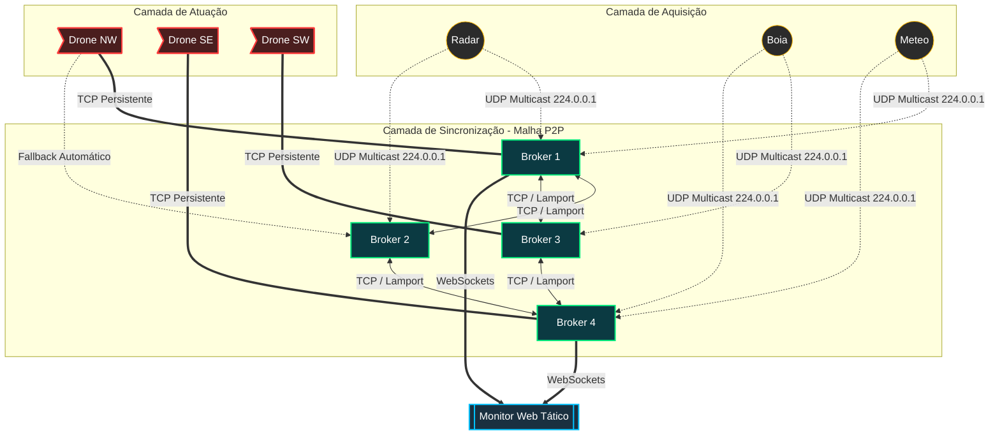

# HormuzNet: Arquitetura Descentralizada e Autônoma

## 1. Visão Geral

O desenvolvimento da fase final do HormuzNet focou na transição do sistema de monitoramento para uma arquitetura descentralizada. O objetivo principal foi remover a dependência de "Bases" estáticas, mitigando pontos únicos de falha. A arquitetura da aplicação foi profundamente refatorada para suportar um ecossistema de malha (mesh), onde Sensores, Brokers e Drones atuam como entidades autônomas. A comunicação em rede foi ajustada para garantir a entrega de alertas e o atendimento de ocorrências mesmo diante de indisponibilidade de componentes do sistema.

## 2. O Coração: Os Brokers e a Malha

O controle do sistema é gerenciado por uma rede de Brokers. O mapa operacional foi estruturado em 4 setores geográficos (Noroeste, Nordeste, Sudoeste, Sudeste), com cada Broker primariamente responsável por uma região. O processo de codificação priorizou a formação de uma rede *Peer-to-Peer* (P2P) entre esses servidores.

### Relógio de Lamport
A consistência de estado é a espinha dorsal do sistema descentralizado. Foi adotado o algoritmo do Relógio Lógico de Lamport para estabelecer a ordenação global de eventos, sem depender dos relógios físicos das máquinas. Cada mensagem processada avança o contador lógico, garantindo que as filas de ocorrências sejam idênticas em todos os Brokers e permitindo tomadas de decisão justas e alinhadas.

## 3. Aquisição de Dados: Sensores e UDP Multicast

Para a camada de aquisição, a antiga interface de comunicação Unicast foi descartada em favor do formato Multicast UDP (endereço `224.0.0.1:8080`). Sendo este um padrão de transmissão que envia pacotes para múltiplos destinos simultaneamente, os sensores publicam os dados ambientais e todos os Brokers capturam a mensagem ao mesmo tempo. Isso assegura redundância de dados e previne que falhas pontuais interrompam o fluxo de leitura do ambiente.

## 4. Resposta Rápida: A Frota de Drones Autônomos

A camada de atuação física foi completamente substituída. Os Drones deixaram de ser submetidos a bases locais para se tornarem agentes independentes.

1. **Conexões Diretas e Fallback:** Cada Drone gerencia uma conexão TCP direta com seu Broker primário. Caso ocorra uma desconexão (ex: queda do servidor local), a lógica de negócio foi instruída a executar um *fallback* automático, tentando conexão com os Brokers vizinhos até encontrar um servidor ativo para assumir sua coordenação.
2. **Ciclo de Vida e Abates:** O drone entra no estado de missão após o despacho. O processo de codificação focou na inserção de um modelo probabilístico: existe uma chance configurada de 10% de o drone ser classificado como abatido ou perdido durante o trajeto. Quando isso ocorre, a execução do nó é encerrada e a rede realoca a ocorrência para outro drone disponível.
3. **Mecânica Operacional:** A simulação foi otimizada para remover lógicas de bateria e recarga, concentrando os esforços do software exclusivamente no gerenciamento distribuído e no tempo de resposta em campo.

## 5. Exclusão Mútua Simplificada

A coordenação descentralizada exigiu a implementação de um mecanismo de exclusão mútua. Com todos os Brokers possuindo a mesma fila de prioridade, era necessário prevenir que múltiplos drones fossem despachados para a mesma localização. A responsabilidade deste controle recai sobre o Broker que detém a conexão TCP ativa com o drone mais apropriado. Ao acionar o despacho, o Broker notifica os demais servidores da rede, que marcam o evento como atendido, mantendo o código limpo e evitando corridas críticas.

## 6. A Interface Tática (Monitor)

A camada de visão atua como uma interface de consolidação. Projetada como um painel *web*, ela recebe dados via WebSockets de toda a rede de Brokers. O design da interface exibe o Estreito de Ormuz mapeado sob quatro quadrantes de sobreposição, ilustrando visualmente a área de operação de cada servidor. Controladores específicos cuidam da renderização dinâmica de Sensores, Brokers e da movimentação fluida dos Drones Autônomos em tempo real na tela.

## 7. Modelo Visual de Comunicação da Arquitetura

Abaixo encontra-se a representação gráfica do fluxo de dados e conectividade da malha descentralizada:

